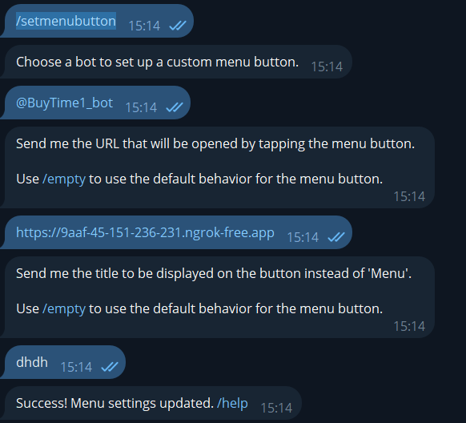
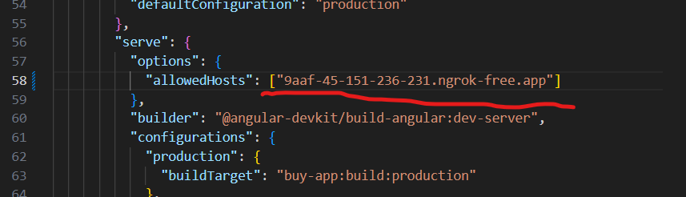
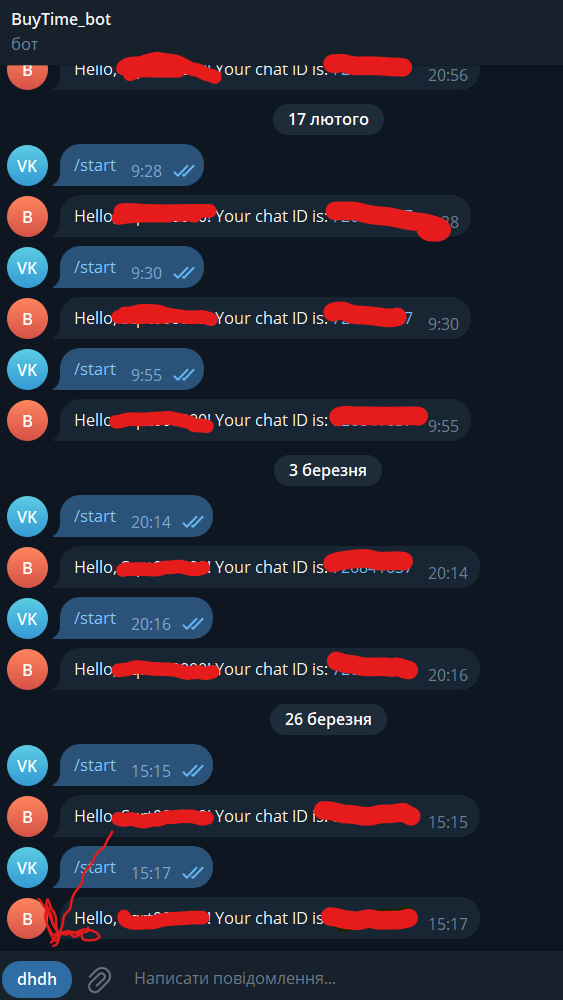

Інструкція по запуску проетку запуск виконувся на операційній ситемі Windows та в середовищі розробки VS Code:

1. Для початку потрібно створити бота в телеграмі це робиться за допомогою https://t.me/BotFather після його створення ви отримаєте ключ бота наприклад "7551270818:AAFcpELcLOyg5R9gjZ4SGIEqqwRJXbJl3Y0" його необхідно вставити в код server.js 13 рядок.

2. Далі в терміналі необхідно вести команду ng serve це для запуску frontend частни.

3. Наступний крок запуск "костиля" node server.js це запуск самого бота після чого боту необхідно надісляти повідомлення. Цей код необхідно буде перести в бек.

4. Далі запуск ngrok для тимчасового хосту по команді ngrok http localhost:4200    .

5. Після 4 кроку ми отримаємо посилання яке необхідно надіслати в bot father https://t.me/BotFather далі порядок цього надсилання:
    
    --- В Botfather вводимо команду /setmenubutton після чого обераємо створеного бота після чого надсилає посилання яке було сворено за допогою ngrok після чого задаємо назву кнопкі приклад інструкці нижще представлений скріном.

    

6. Далі шукаємо в проекті файл angular.json та змінюємо рядок 58 приклад
        це посилпння ngrok https://9aaf-45-151-236-231.ngrok-free.app
        з нього в 58 рядок потрібно вставити цю частину 
        9aaf-45-151-236-231.ngrok-free.app
    

7. Після чого перезапускаємо команду ng serve та заходимо в бот і натискаємо на створену кнопку приклад нижще 
    
    Після цього буде відкрито miniapp tg
    Вітаю це була перша частина запуску проекту якщо ви бечете темний екран або якійсь надпис почніть все з початку)

8. Якщо крок 7 виконаний можна перейти до запуску backend частини для цього потрібно запусти проект беку він буде наданий викладачем) для його запуску треба відкрити консоль в тому проекті та виконати послідовність команд  
    - cd BuyTime_Api
    - dotnet run
ПІсля чого він буде запущений для перевірки перейдіть по посиланню http://localhost:5258/swagger/index.html якщо посилання не працює перевірте цю частину localhost:5258.

Маю надію що це допоможе при запуску і подальшій його розробці. 
Якщо є питання звяжіться через викладача зі мною.